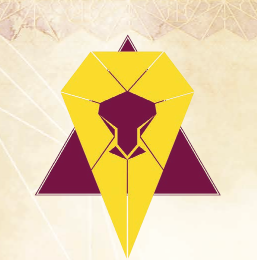



**House Status:** Great House  
**Home World:** Kaitain; also holds Salusa Secundus (planet training camp for the Sardaukar)  
**House Traits:** Imperial, Wealthy, Control through any means necessary  
**Primary domain:** Imperial Rule  
**Secondary domain:** Military Training  
**Key Figures:** Padishah Emperor Shaddam IV (Ruler); Count Hasimir Fenring  
**Assumed Relationship with your House:** Ally  

**Notes:**  
The Imperial House and greatest of the Houses of the Landsraad, House Corrino has ruled the Known Universe for thousands of years. Mired in intrigues both internal and
external, the Corrinos are ruthless and as addicted to power as they are to the spice.  

House Corrino rose to power approximately ten thousand years ago, after a decisive victory at the Battle of Corrin, from which the House takes its name. Their household
moved to their present throne-world, Kaitain, from their original homeworld of Salusa Secundus, which they maintained as a prison planet.  

The Imperial House’s grip on the Empire is absolute. Ruling through a combination of subtle political acumen and the strategic application of brute force, their supremacy has been unchallenged for an unthinkable era.  

Corrino hegemony is maintained by the infamous Sardaukar, the premier fighting force of the entire Empire. The merest rumor of their deployment being sufficient
to see belligerents seek terms of surrender, the Sardaukar are more than capable of seeing that House Corrino keeps their throne.  

It is believed that only if all the Houses of the Landsraad were to join in opposition to House Corrino might they have a chance at defeating the Sardaukar. It is a notion the
Corrinos take seriously, working tirelessly to sow division among allies and enemies alike.  
