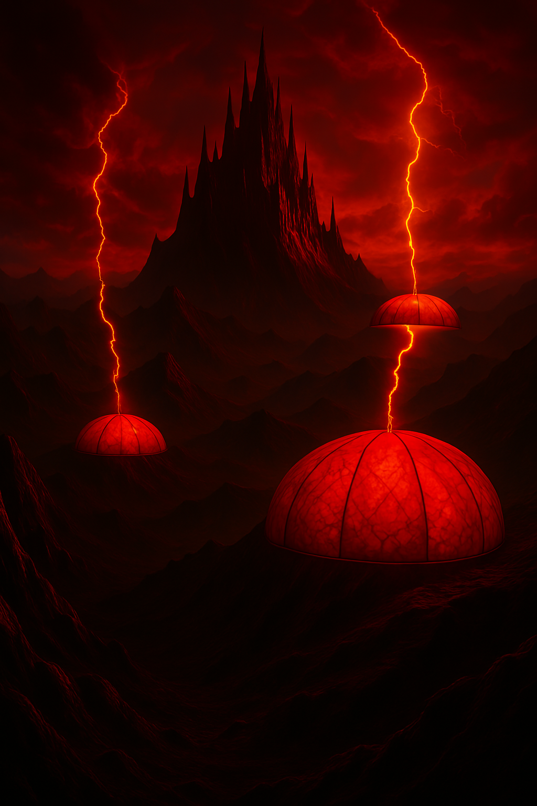

  
  
  
  
**House Status:** Major House  
**Home World:** Thundäruk  
**House Traits:** Religious Power; Deceptive  
**Primary domain:** Genetically Modified Giant Moth Dome Technology  
**Secondary domains:** Worker Management (Industrial); Espionage (Supply of Incriminating Information)  
**Key Figures:** Count Leoplod Varmoth (deceased); Count Lucar Varmoth; Kleya Leanne Naser Varmoth; Lavro; Lundrak Varmint; Takshaka Vahal; Zibid-i Paro  

**Notes:**  
House Varmoth is from planet Thundäruk, where they have developed giant moth chrysalises made of a material that harvests energy from lightning and storms that can be formed into giant bio domes called Chrysalis Bastials that can be grown to the size that can house cities. These chrysalises also produce giant moths that can be ridden.  

Thundäruk is a dark, inhospitable and mountainous planet with persistent lightning storms and only heated from a red dwarf star. The Chrysalis Bastials help to concentrate and focus the available light onto the population. The majority of the population live in the cities, controlled by the threat of being outcast from the domes into a world of pure survival and also by devotion to their Storm Gods (though this is now just a superficial control mechanism for the noble House). Thundäruk absorbs illicit and compromising intelligence but little information gets out of the protecting and secretive society.  

The noble classes dress in ostentatious clothing made of moth silk material and generally have long beards and curly hair.  
  
  