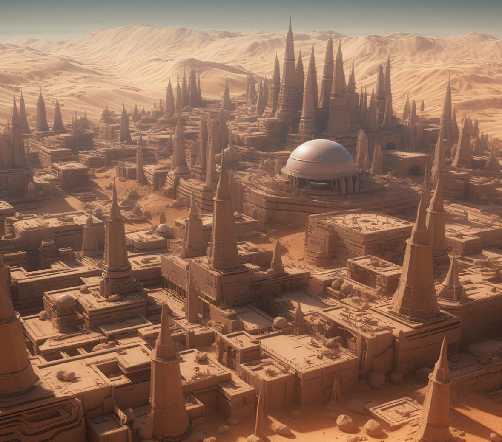


  
  
  
Arrakeen was once the capital of Arrakis since its
foundation until the coming of the Harkonnens. While
few doubt that the purpose-built city of Carthag is
more luxurious than the sparser, and older, confines
of Arrakeen, the former capital is definitely easier to
defend and, despite the depredations of the Harkonnens during their reign, the residency of the planetary
governor still retains a modicum of respect amongst
the indigenous population. Arrakeen is built with wide,
open streets, slablike architecture, and high stone walls
to shunt wind and to facilitate the almost constant
removal of sand. On the main thoroughfares through
the city, particularly the one leading to the governor’s
residence, date palms are grown and maintained—
despite the difficulty and expense of doing so. This is,
in most senses, a perfect illustration of how Arrakeen
is used by those who come from offworld. Arrakeen
is not a model of ostentatious luxury in the way that
Carthag is, but it is not truly of Arrakis.  

While most homes and other buildings have water traps
and other features to try and catch what little moisture
there might be in the air, the most common means of
acquiring water is to buy it from a water-seller. These
merchants tend to drive small, mechanical carts with
large storage drums attached to the back. A small tap
allows water to be decanted into a personal water
bottle, or a large flue enables people to buy enough
water to fill a container for a whole family. These
merchants tend to own large areas of land just outside
Arrakeen, which are built into large-scale water farms,
with deep-sunk wells and converted stillsuit technology,
used to draw moisture from the air and retain it. While
such a job is essential to continuing life in Arrakeen, the
job is looked down on both by the off-world inhabitants
of the city, who consider it an uncouth practice, and
by the Fremen—for whom the idea of selling water in
this fashion is extremely distasteful. The location of the
water-sellers’ residences, however, does provide a key
to the architectural disposition of the city itself.  

### ARRAKEEN ARCHITECTURE  
The outskirts of Arrakeen consist of large water-farms
and a few collections of still-tents where those Fremen
who operate within the city, but do not live within a
permanent residence, dwell. There is then a circle of
small dwellings, in which most of the working people
of Arrakeen live; these are the street cleaners, repair
workers, miners who are no longer as active on the
dunes as they once were. This is also where most of
the spice refining facilities are found, with many of the
inhabitants living extremely close to their work, tending
to the machines which process spice for delivery to the
Emperor or other customers. The next layer of the city
is chiefly composed of engineers and those vital to the
spice mining and spice trade. The center of the city is
where the elite live—in the largest and most carefully
maintained of buildings.  

The buildings of Arrakeen are remarkable in themselves,
built in an extremely peculiar style. Most of the architecture of Arrakeen is constructed from cyclopean blocks of
dark or grey stone, quarried from the various stretches
of mountain and bedrock nearby. This is supplemented
with other varieties of stone, brought in from offworld.
The stark interior architecture itself recalls ancient Terran
models, with high ceilings, crossbeams stretching across
open spaces of dark stone. This aesthetic is found
throughout the Arrakeen dwellings, though, obviously,
on a substantially less spectacular scale. The governor’s
residency is infamous for the water it consumes, and
the few Fremen who serve its current occupant whisper
of the presence of a ‘Weirding Room’, to which water
is diverted in vast quantities. To what purpose, few are
truly certain. Those who have been within it describe
it as a paradise, though, again, they are less than clear
what kind of paradise it might be.  

### THE POPULATION OF ARRAKEEN
Arrakeen’s population is extremely heterogeneous, with
people from throughout the universe taking residence
there. The presence of the spice and Dune’s political
importance lures offworlders in great numbers, adding
to the native population, divided between Fremen—
nomadic, desert-dwelling descendants of ancient settlers on the planet, and a class of people categorized
throughout the Imperium as ‘pyons’, those born on the
world and essentially falling under the ruling House’s
authority. To natives of Arrakis, these are the ‘city folk’.
Most organized labor on Arrakis is performed by the city
folk, though they are supplemented by Fremen—often
employed as servants, or less frequently as bodyguards.
Fremen are considered poor workers by most city-dwellers, and frequently the Fremen who work alongside the
city-folk are those who have lost their role in Fremen
society, or are there for reasons of their own, particularly spying on the ruling House. Most offworlders in
Arrakeen are there in a political capacity, serving the
interests of a House or of the Guild. Arrakeen is a city of
spies, and the closer one draws to the center of the city,
the more evident this becomes.  

Surrounding the governor’s residency are the various
residences and embassies of the Landsraad. The current
inhabitant of the governor’s residency is Count Hasimir
Fenring the Imperial Spice Observer—while the fief of
Arrakis is held by the Harkonnens, their preference for
their own, newly built city, meant that the residency
lay empty. While Count Fenring (described on p.259)
is typically at the side of the Padishah Emperor, he is
also occasionally dispatched to Arrakis to observe how
the planet is being run and ensure that the spice flows
consistently. This has resulted in considerable additional
political and espionage resources being concentrated
in Arrakeen, as the Houses see Fenring’s presence as
being a route to earning the ear of the Emperor himself.  

Fenring’s formidable reputation as an assassin and skilled
duelist—said to be better than even one of the Emperor’s
Saudaukar—renders this a risky proposition, and the
intrigue concentrated around the governor’s residency is
careful, polite even. The assassinations that do take place
are carefully orchestrated and use the most sophisticated
of methods. There is little use of crude methods such as
hunter-seekers. Instead, most favour carefully administered
poisons which induce death while obscuring the cause.  

The Emperor’s presence is felt strongly in Arrakeen, far
more strongly than elsewhere on the planet, and Corrino imagery manifests in surprising abundance. Some
Mentats have speculated that this is a deliberate slight
to the Harkonnens, and that the Emperor may only be
a few years from removing their fief, while others insist
that the relationship between the Harkonnens and the
Padishah Emperor are actually closer and stronger than
are commonly supposed.  

Arrakeen is a city that stands in defiance to the hellish
conditions surrounding it. It is built to endure, certainly,
but also to prove the power of the Corrino Empire over
both the planet itself, and the other Major Houses that
might seek to claim the fief. Many have some influence
over its disposition, from CHOAM to the Spacing Guild
to the Landsraad and even the Fremen, but ultimately,
from a legal standpoint, spice melange is the preserve
of the Padishah Emperor, no matter who may temporarily hold sway over its control.