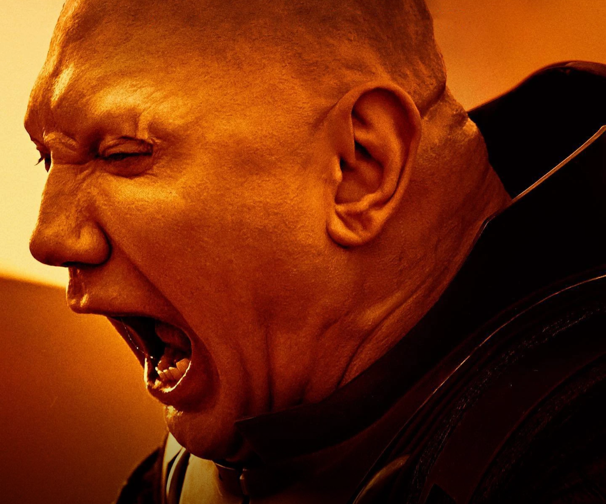


  
   
  
Glossu was an infamous brutal tyrant and one of the most hated men of his time. Having killed his father on their homeworld of Lankiveil Rabban was taken under the wing of Baron Harkonnen. The Baron tried to train him in the art of statecraft and subtle deception. However, Rabban never really understood the complexities of politics and often ruined a plan by taking direct action in an attempt to impress the Baron.

As Governor of Arrakis, ‘The Beast’ brutalised the
population of Arrakis, and the native Fremen in particular, for many years. He was too unwise to realise that this
mismanagement was precisely what the Baron wanted.

While the subtleties of his position escaped him,
Rabban didn’t really care. The governance of Arrakis
allowed him opportunity for betrayal, revenge, and savagery, which is all he really wanted. Rabban was utterly dedicated to the Harkonnen cause, knowing that it would
continue to give him endless opportunities to delight in
violence.
